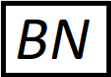

# Break Notifier

    

## Overview

Break Notifier is a WinForm application that notify the user to take a break every hour(Time can be change in preferences!).

## Features
1. Start at logon
2. Change break time
3. Change time between breaks
4. Play sound on break start
5. Play sound when the break is about to end
6. Play sound when the break is finished
7. End break befoer time elapsed

## Requirements

Windows operating system.

## Quick Start

Download and run:
1. If you have .NET 5 runtime downloaded on your machine, then download the from [here (Published as Framework-Dependent)](https://github.com/fhddev/break-notifier/releases/download/v0.1.0/break-notifier_fd.zip)
2. If you do not have .NET 5 runtime installed on your machine, then download from the list:
    - [Self-Contained](https://github.com/fhddev/break-notifier/releases/download/v0.1.0/break-notifier_sc.zip)
    - [Self-Contained (Unused assamblies trimmed)](https://github.com/fhddev/break-notifier/releases/download/v0.1.0/break-notifier_sc_tua.zip)
    - (Recommended) [Self-Contained Single File (Unsed assablies trimmed)](https://github.com/fhddev/break-notifier/releases/download/v0.1.0/break-notifier_sc_tua_sf.zip)

## License

This project uses the following license: MIT license.

## Contributing to Break Notifier

To contribute to Break Notifier, follow these steps:

1. Fork this repository.
2. Create a branch: `git checkout -b <branch_name>`.
3. Make your changes and commit them: `git commit -m '<commit_message>'`
4. Push to the original branch: `git push origin <project_name>/<location>`
5. Create the pull request.

Alternatively see the GitHub documentation on [creating a pull request](https://help.github.com/en/github/collaborating-with-issues-and-pull-requests/creating-a-pull-request).

## Author

Developed by [@fhddev](https://github.com/fhddev)
